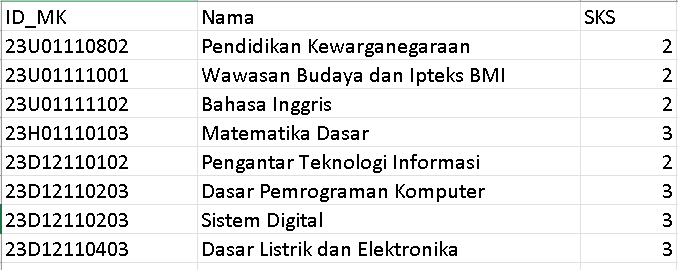
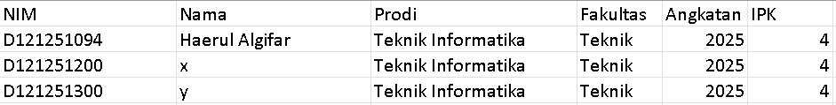
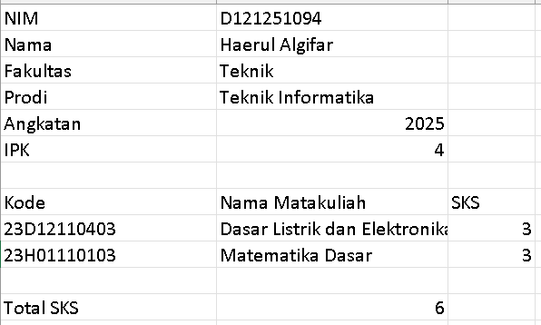

<h1 align="center">
  
</h1>

<h3 align="center">
  
</h3>

<p align="center">
  
</p>

Proyek ini adalah sistem manajemen akademik sederhana berbasis konsol yang ditulis dalam bahasa C. Program ini memungkinkan pengguna untuk mengelola data master **Mahasiswa** dan **Matakuliah**, serta mencatat **Kartu Rencana Studi (KRS)**. Semua data disimpan secara persisten dalam file `.csv`.

---

## ✨ Fitur Utama

- 👨‍🎓 **Manajemen Mahasiswa:**
  - Tambah data mahasiswa baru (NIM, Nama, Prodi, Fakultas, Angkatan, IPK).
  - Hapus data mahasiswa berdasarkan NIM (dengan konfirmasi).
- 📚 **Manajemen Matakuliah:**
  - Tambah data matakuliah baru (ID MK, Nama, SKS).
- ✍️ **Manajemen KRS:**
  - Tambah data KRS untuk menghubungkan mahasiswa dengan matakuliah yang diambil.
- 🔍 **Pencarian Cerdas:**
  - Cari data KRS lengkap mahasiswa berdasarkan **NIM** atau **Nama**.
  - Menampilkan detail mahasiswa (IPK, Fakultas) dan daftar matakuliah yang diambil (dengan total SKS).
- 📄 **Ekspor ke CSV:**
  - Hasil pencarian KRS secara otomatis diekspor ke file `.csv` terpisah (misal: `KRS_D121251094.csv`) untuk pelaporan.
- 💾 **Penyimpanan Persisten:**
  - Semua data disimpan (mode _append_) di file `mahasiswa.csv`, `matakuliah.csv`, dan `krs.csv`.
- 🛡️ **Validasi Duplikat:**
  - Sistem secara otomatis mencegah data duplikat (NIM, ID MK, dan entri KRS) untuk menjaga integritas data.

---

## 📂 Struktur Proyek

Berikut adalah tampilan struktur file dan file-file `.csv` yang dihasilkan oleh program.

<details>
<summary><b><code>matakuliah.csv</code> (Tampilan File Matakuliah di Excel)</b></summary>

<p align="center">

</p>
</details>

<details>
<summary><b><code>mahasiswa.csv</code> (Tampilan File Mahasiswa di Excel)</b></summary>

<p align="center">

</p>
</details>

<details>
<summary><b><code>krs.csv</code> (Tampilan File KRS di Excel)</b></summary>

<p align="center">

</p>
</details>

<details>
<summary><b><code>KRS_D121251094.csv</code> (Tampilan File KRS milik Mahasiswa di Excel)</b></summary>

<p align="center">

</p>
</details>

---

## 🚀 Memulai

Pastikan Anda memiliki compiler C (seperti **gcc**) yang terinstal di sistem Anda.

1.  Buka terminal di direktori utama proyek.
2.  Kompilasi program menggunakan perintah berikut:

    ```bash
    gcc main.c filedata.c -o main.exe
    ```

3.  Setelah perintah di atas berhasil, file `main.exe` akan dibuat di direktori Anda.

---

## ⌨️ Cara Menjalankan

Jalankan program dari terminal dengan perintah `./main.exe` diikuti dengan nomor menu yang diinginkan.

```bash
./main.exe 1  # 📚 Tambah Data Matakuliah
./main.exe 2  # 👨‍🎓 Tambah Data Mahasiswa
./main.exe 3  # ✍️  Tambah Data KRS
./main.exe 4  # 🔍 Cari KRS Mahasiswa (dan Ekspor ke CSV)
./main.exe 5  # ❌ Hapus Data Mahasiswa
./main.exe 6  # 🐞 Tampilkan isi file (Mode Debug)
```

🖼️ Galeri / Contoh Penggunaan
Klik untuk melihat contoh output dari setiap perintah:

<details>
<summary><b><code>./main.exe 1</code> (Tambah Matakuliah)</b></summary>

<p align="center">

</p>
</details>
<details>
<summary><b><code>./main.exe 2</code> (Tambah Mahasiswa)</b></summary>

<p align="center">

</p>
</details>
<details>
<summary><b><code>./main.exe 3</code> (Tambah KRS)</b></summary>

<p align="center">

</p>
</details>
<details>
<summary><b><code>./main.exe 4</code> (Cari KRS & Ekspor .csv)</b></summary>

<p>Perintah ini akan menampilkan data di konsol dan otomatis membuat file laporan CSV seperti <code>KRS_D121251094.csv</code>.</p>
<p align="center">

</p>
</details>
<details>
<summary><b><code>./main.exe 5</code> (Hapus Mahasiswa)</b></summary>

<p align="center">

</p>
</details>
<details>
<summary><b><code>./main.exe 6</code> (Tampilkan File Debug)</b></summary>

<p align="center">

</p>
</details>
<p align="center">

</p>
